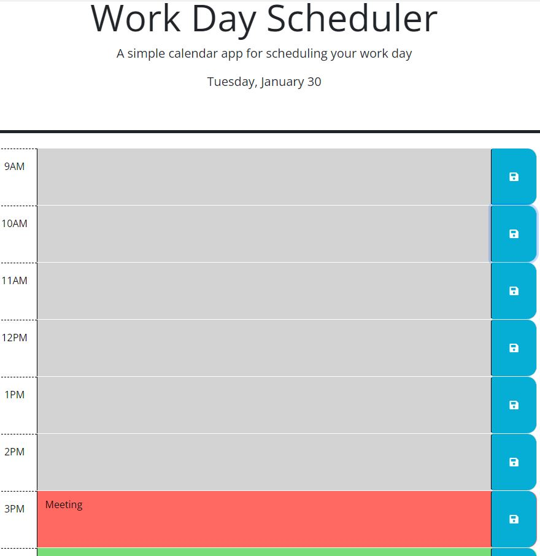

# 05 Third-Party APIs: Work Day Scheduler Assignment Completion

Student: Ryan Moises

## Objective

To create a work day scheduler that allows the user to save events/reminders in time slots during the typical working day. using third-party APIs such as jQuery and Day.js.

## User Story

```
AS AN employee with a busy schedule
I WANT to add important events to a daily planner
SO THAT I can manage my time effectively
```

## Acceptance Criteria

```
GIVEN I am using a daily planner to create a schedule
WHEN I open the planner
THEN the current day is displayed at the top of the calendar
WHEN I scroll down
THEN I am presented with timeblocks for standard business hours of 9am&ndash;5pm
WHEN I view the timeblocks for that day
THEN each timeblock is color coded to indicate whether it is in the past, present, or future
WHEN I click into a timeblock
THEN I can enter an event
WHEN I click the save button for that timeblock
THEN the text for that event is saved in local storage
WHEN I refresh the page
THEN the saved events persist
```

## URLs and Images

The following link is the student's URL to the completed assignment:
(https://ryanmoises5.github.io/Workday-Scheduler-RMwk5/)

The following link is the Github repository where the associated files are located:
(https://github.com/RyanMoises5/Workday-Scheduler-RMwk5)



---

Student: Ryan Moises
